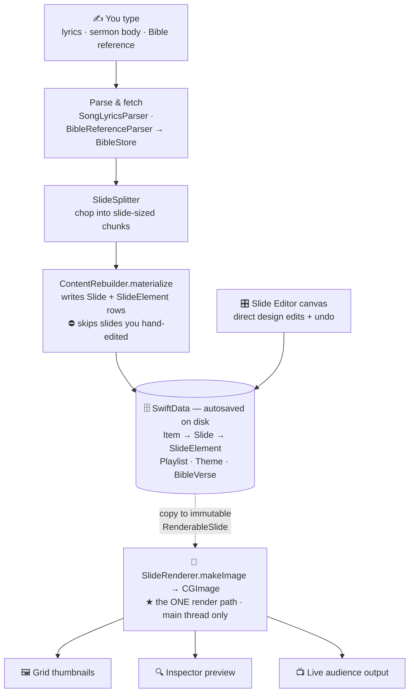
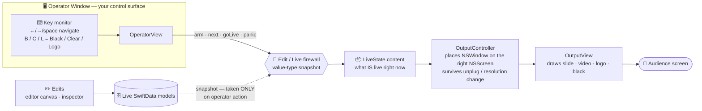
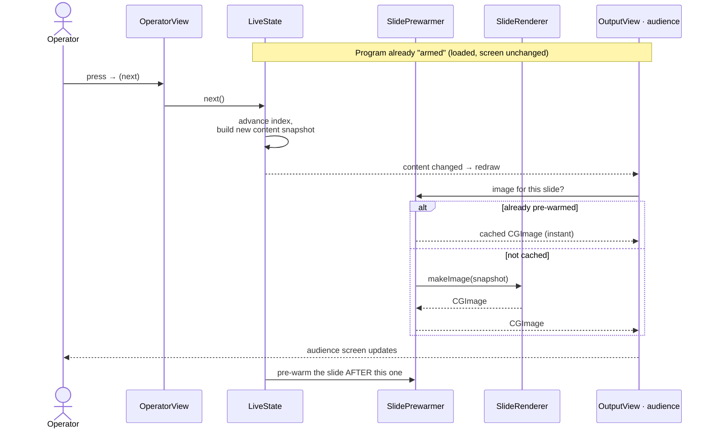

# How Jerusalem Works

A visual tour of the app's moving parts. Three diagrams, each answering one question:

1. **How does typed content become pixels?** (the data + render pipeline)
2. **How does the operator control the audience screen — safely?** (the edit/live firewall)
3. **What happens when the operator presses "next"?** (a step-by-step sequence)

The whole design exists to keep one promise: **never fail on Sunday morning.** Read this
alongside [`CODE-MAP.md`](CODE-MAP.md) (the per-file index) and [`CLAUDE.md`](CLAUDE.md)
(the architecture rules).

> **Reading the arrows:** a **dotted arrow** means *a value-type snapshot is copied* — an
> immutable clone, not a live reference. Those copies are the safety boundary: the renderer
> and the audience screen only ever touch snapshots, never the live database.

---

## 1. From typed content to pixels

You author content in plain language (lyrics, a sermon body, a Bible reference). Parsers and
the `SlideSplitter` turn it into slide-sized chunks, and `ContentRebuilder` writes the actual
`Slide`/`SlideElement` rows. You can also design slides directly on the editor canvas. Then
**one** function — `SlideRenderer.makeImage` — turns any slide into an image, and that single
render path feeds *everything* you see: thumbnails, the inspector preview, and the live screen.

**Why it's built this way:** because thumbnails, preview, and the audience screen all go
through the *same* renderer, what you see in the grid is exactly what the congregation gets —
there's no second code path that could drift or fail differently on Sunday.

---

## 2. Controlling the live screen — the edit/live firewall

This is the safety-critical part. Editing a slide in the editor or operator window changes the
**database**, but it does **not** change what's on the audience screen. The audience screen
only reflects `LiveState.content`, which is an **immutable snapshot** taken *only when the
operator deliberately acts* (arm / next / go-live). So you can fix a typo mid-service and the
congregation sees nothing change until you choose to push it live.

**Two safety behaviors to notice:**

- **Arm vs. go-live.** *Arming* a program loads it without touching the screen; only `next()`
  / `goLive(id:)` actually change output. Loading the next song can't accidentally cut to it.
- **The output window is hardened.** `OutputController` owns a real AppKit `NSWindow`, picks
  the correct display, and watches for displays being unplugged or changing resolution so it
  fails over to a remaining screen instead of crashing. Video falls back to black rather than
  ever taking the output down.

---

## 3. What happens when you press "next"

A concrete walkthrough of advancing one slide during a service. Note the `SlidePrewarmer`: the
*next* slide is usually already rendered and cached, so the screen changes instantly, and the
app immediately pre-warms the slide after that.

---

## The whole thing in one breath

- **Author** in plain text → **parsers + `ContentRebuilder`** materialize `Slide` rows in
  **SwiftData** (autosaved, so a crash loses nothing).
- **One renderer** (`SlideRenderer`) draws every slide; thumbnails, preview, and live output
  are guaranteed identical.
- **`LiveState`** holds an **immutable snapshot** of what's on screen — the firewall that lets
  you edit freely without disturbing the congregation until you act.
- **`OutputController` + `OutputView`** own a hardened AppKit window on the projector,
  resilient to unplug/resolution changes, with video that fails to black, never to a crash.

Every arrow above ultimately serves the same goal: **predictable, crash-proof output on
Sunday morning.**
